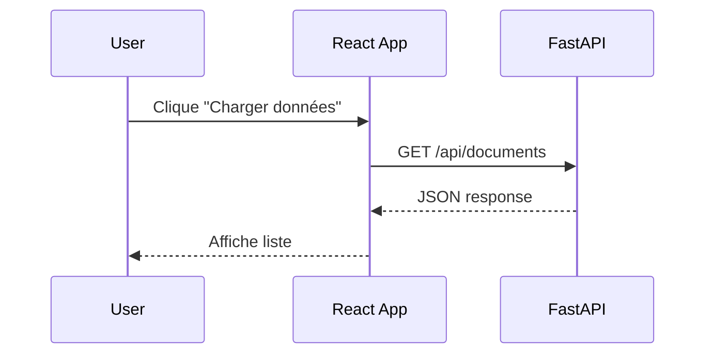

# Instructions Claude Code - Guide React UI pour Ingénieur IA/Data

## 🎯 Objectif du projet

Créer une documentation Docusaurus complète pour aider les ingénieurs IA/Data à créer des interfaces React d'annotation et de visualisation, en utilisant l'IA (Claude Code) pour accélérer le développement.

## 📚 Contexte

**Public cible** : Ingénieur IA/Data expérimenté en backend (Python/FastAPI) mais novice en frontend React

**Stack technique du guide** :
- React + Vite
- React-Bootstrap (personnalisation basique)
- Recharts (visualisation)
- TanStack Table (tableaux interactifs)
- FastAPI (backend API)

**Cas d'usage principaux** :
- Interfaces d'annotation avec validation de prédictions ML
- Dashboards de visualisation de métriques
- Tableaux de données avec tri/filtres/pagination

## 🏗️ Architecture Docusaurus

```
guide-react-ia/
├── docs/
│   ├── intro.md
│   ├── fundamentals/
│   │   ├── _category_.json
│   │   ├── section-1-rappels-react.md
│   │   └── section-2-setup-vite.md
│   ├── api-integration/
│   │   ├── _category_.json
│   │   └── section-3-fastapi.md
│   ├── interfaces/
│   │   ├── _category_.json
│   │   ├── section-4-annotation.md
│   │   ├── section-5-tables.md
│   │   └── section-6-dashboard.md
│   ├── advanced/
│   │   ├── _category_.json
│   │   ├── section-7-best-practices.md
│   │   └── section-8-claude-workflow.md
│   └── conclusion.md
├── src/
│   ├── components/
│   │   ├── Demo/  (composants démo interactifs)
│   │   └── CodeExample/  (affichage de code avec tabs)
│   └── css/
│       └── custom.css
├── static/
│   └── img/  (wireframes, screenshots)
├── docusaurus.config.js
└── sidebars.js
```

## 📝 Standards de rédaction

### Ton et style
- **Pragmatique et direct** : pas de jargon inutile
- **Focus "comment faire"** : moins de théorie, plus de pratique
- **Empathique** : comprendre que le lecteur vient du backend
- **Concret** : chaque concept illustré par un exemple

### Structure de chaque section (*.md)

```markdown
---
sidebar_position: X
title: Titre de la section
description: Description courte
---

# Titre de la section

## 🎯 Ce que vous allez apprendre

- Point 1
- Point 2
- Point 3

## Pourquoi c'est important

[1-2 paragraphes expliquant le contexte]

## Concepts clés

[Explication concise des concepts théoriques nécessaires]

## Exemple pratique : [Nom de l'exemple]

[Code commenté avec explications]

### Code complet

```jsx
// Code exemple fonctionnel
```

### Explications détaillées

[Décortication du code section par section]

## 🤖 Prompts Claude Code recommandés

:::tip Prompt pour générer ce composant
```
[Prompt exact à utiliser dans Claude Code]
```
:::

:::info Itération courante
Si Claude génère [problème X], demandez-lui de [solution Y]
:::

## ⚠️ Pièges à éviter

- Erreur courante 1
- Erreur courante 2

## 🔗 Ressources

- [Lien vers doc officielle]
- [Lien vers exemple complet sur GitHub]

## ➡️ Prochaine étape

Dans la section suivante, nous verrons...
```

### Utilisation du MDX

Pour les exemples interactifs :

```mdx
import ComponentDemo from '@site/src/components/Demo/ComponentDemo';
import { Button } from 'react-bootstrap';

## Démo interactive

<ComponentDemo>
  <Button variant="primary">Essayez ce bouton</Button>
</ComponentDemo>
```

### Admonitions (callouts)

```markdown
:::note Note
Information contextuelle
:::

:::tip Astuce
Conseil pratique
:::

:::warning Attention
Point important à ne pas rater
:::

:::danger Erreur fréquente
Piège classique à éviter
:::

:::info Claude Code
Prompts et workflows spécifiques à Claude Code
:::
```

### Code avec tabs (comparer approches)

```mdx
import Tabs from '@theme/Tabs';
import TabItem from '@theme/TabItem';

<Tabs>
  <TabItem value="vite" label="Avec Vite" default>
    ```bash
    npm create vite@latest my-app -- --template react
    ```
  </TabItem>
  <TabItem value="cra" label="Avec Create React App">
    ```bash
    npx create-react-app my-app
    ```
  </TabItem>
</Tabs>
```

## 🎨 Guidelines visuelles

### Wireframes
- Utiliser des outils simples (Excalidraw, draw.io)
- Format : PNG, max 800px de large
- Placer dans `/static/img/wireframes/`

### Screenshots
- Capturer les interfaces finales
- Annoter les éléments importants
- Placer dans `/static/img/screenshots/`

### Diagrammes
- Architecture : Mermaid (intégré Docusaurus)
- Flux de données : Mermaid sequence diagrams

Exemple :


## 📦 Exemples fils rouges

### 1. AnnotaTool (Application d'annotation)

**Features** :
- Liste de documents avec prédictions IA
- Scores de confiance (badges colorés)
- Actions : Valider / Corriger catégorie
- Sauvegarde bulk vers API

**Fichiers exemples** :
- `src/components/Demo/AnnotationList.jsx`
- `docs/interfaces/section-4-annotation.md`

### 2. DashBoard ML (Dashboard de monitoring)

**Features** :
- Graphiques : barres (annotations/catégorie), ligne (évolution), camembert (distribution)
- Cards avec métriques clés
- Bouton refresh manuel
- Layout responsive (Grid 2x2)

**Fichiers exemples** :
- `src/components/Demo/Dashboard.jsx`
- `docs/interfaces/section-6-dashboard.md`

### 3. DataTable (Tableau interactif)

**Features** :
- Colonnes : Document, Catégorie, Score, Statut, Actions
- Tri par colonne
- Filtres (par statut)
- Pagination (20 items/page)

**Fichiers exemples** :
- `src/components/Demo/DataTable.jsx`
- `docs/interfaces/section-5-tables.md`

## 🔧 Configuration Docusaurus

### docusaurus.config.js - Points clés

```javascript
module.exports = {
  title: 'Guide React UI pour IA/Data',
  tagline: 'Créer des interfaces d\'annotation et de visualisation avec l\'aide de l\'IA',
  url: 'https://[USERNAME].github.io',
  baseUrl: '/guide-react-ia/',
  organizationName: '[USERNAME]',
  projectName: 'guide-react-ia',
  
  themeConfig: {
    navbar: {
      title: 'Guide React UI',
      items: [
        {
          type: 'doc',
          docId: 'intro',
          position: 'left',
          label: 'Documentation',
        },
        {
          href: 'https://github.com/[USERNAME]/guide-react-ia',
          label: 'GitHub',
          position: 'right',
        },
      ],
    },
    prism: {
      theme: lightCodeTheme,
      darkTheme: darkCodeTheme,
      additionalLanguages: ['bash', 'python', 'jsx'],
    },
  },
  
  presets: [
    [
      'classic',
      {
        docs: {
          sidebarPath: require.resolve('./sidebars.js'),
          routeBasePath: '/', // Doc à la racine
        },
        theme: {
          customCss: require.resolve('./src/css/custom.css'),
        },
      },
    ],
  ],
};
```

### sidebars.js

```javascript
module.exports = {
  tutorialSidebar: [
    'intro',
    {
      type: 'category',
      label: 'Fondamentaux',
      items: [
        'fundamentals/section-1-rappels-react',
        'fundamentals/section-2-setup-vite',
      ],
    },
    {
      type: 'category',
      label: 'Intégration API',
      items: ['api-integration/section-3-fastapi'],
    },
    {
      type: 'category',
      label: 'Interfaces Spécialisées',
      items: [
        'interfaces/section-4-annotation',
        'interfaces/section-5-tables',
        'interfaces/section-6-dashboard',
      ],
    },
    {
      type: 'category',
      label: 'Avancé',
      items: [
        'advanced/section-7-best-practices',
        'advanced/section-8-claude-workflow',
      ],
    },
    'conclusion',
  ],
};
```

## 🚀 Déploiement GitHub Pages

### Configuration `.github/workflows/deploy.yml`

```yaml
name: Deploy to GitHub Pages

on:
  push:
    branches:
      - main

permissions:
  contents: read
  pages: write
  id-token: write

jobs:
  deploy:
    environment:
      name: github-pages
      url: ${{ steps.deployment.outputs.page_url }}
    runs-on: ubuntu-latest
    steps:
      - uses: actions/checkout@v4
      - uses: actions/setup-node@v4
        with:
          node-version: 18
          cache: npm
      
      - name: Install dependencies
        run: npm ci
      
      - name: Build website
        run: npm run build
      
      - name: Setup Pages
        uses: actions/configure-pages@v4
      
      - name: Upload artifact
        uses: actions/upload-pages-artifact@v3
        with:
          path: ./build
      
      - name: Deploy to GitHub Pages
        id: deployment
        uses: actions/deploy-pages@v4
```

### Configuration repository GitHub

1. Settings → Pages → Source : "GitHub Actions"
2. Vérifier `docusaurus.config.js` : `baseUrl` correspond au nom du repo

## 📋 Checklist de génération

Pour chaque section de documentation :

- [ ] Titre clair et descriptif
- [ ] Section "Ce que vous allez apprendre"
- [ ] Explication du "pourquoi" avant le "comment"
- [ ] Au moins un exemple de code complet et fonctionnel
- [ ] Explications ligne par ligne des parties importantes
- [ ] Section "Prompts Claude Code recommandés"
- [ ] Section "Pièges à éviter" avec 2-3 erreurs courantes
- [ ] Liens vers ressources externes (doc officielle, etc.)
- [ ] Transition vers la section suivante
- [ ] Code testé et fonctionnel
- [ ] Screenshots ou wireframes si pertinent

## 🤖 Workflow avec Claude Code

### Phase 1 : Setup initial
```
Crée un projet Docusaurus nommé "guide-react-ia" avec la structure 
définie dans claude.md. Configure-le pour GitHub Pages avec déploiement
automatique. Utilise le thème classic.
```

### Phase 2 : Génération des sections (itératif)
```
En te basant sur plan-detaille.md, génère le fichier 
docs/fundamentals/section-1-rappels-react.md.

Suis strictement la structure définie dans claude.md :
- Ton pragmatique et direct
- Exemples de code complets
- Section "Prompts Claude Code"
- Admonitions (tips, warnings)

Le contenu doit couvrir : [détails du plan-detaille.md]
```

### Phase 3 : Composants démo
```
Crée un composant React de démo interactif pour illustrer [concept X]
dans src/components/Demo/[NomComposant].jsx.

Ce composant doit :
- Être auto-suffisant (pas de props requises)
- Utiliser React-Bootstrap
- Être visuellement clair
- Montrer [fonctionnalité spécifique]
```

### Phase 4 : Révision et amélioration
```
Révise le fichier docs/[section].md :
1. Vérifie que tous les exemples de code sont corrects
2. Améliore la clarté des explications
3. Ajoute des admonitions si manquantes
4. Vérifie la cohérence du ton
```

## ⚙️ Commandes utiles

```bash
# Développement local
npm start

# Build production
npm run build

# Servir le build localement
npm run serve

# Vérifier les liens cassés
npm run build && npm run serve
```

## 📚 Ressources de référence

- [Docusaurus Documentation](https://docusaurus.io/docs)
- [React Documentation](https://react.dev)
- [React-Bootstrap](https://react-bootstrap.github.io/)
- [Recharts](https://recharts.org/)
- [TanStack Table](https://tanstack.com/table/latest)
- [MDX](https://mdxjs.com/)

## 🎯 Priorités de qualité

1. **Code fonctionnel** : Tous les exemples doivent pouvoir être copiés-collés et fonctionner
2. **Clarté** : Un débutant React doit comprendre sans bloquer
3. **Pragmatisme** : Focus sur "comment faire" plutôt que théorie pure
4. **Prompts Claude** : Donner les bons prompts pour reproduire avec Claude Code
5. **Cohérence** : Même ton, même structure partout

## ✅ Critères de succès

Un ingénieur IA/Data doit pouvoir, après ce guide :
- Créer une app React multi-pages structurée
- Intégrer une API FastAPI proprement
- Utiliser Claude Code efficacement pour le frontend
- Créer une interface d'annotation professionnelle
- Implémenter un dashboard de visualisation
- Appliquer les bonnes pratiques React de base

---

**Version** : 1.0  
**Dernière mise à jour** : Novembre 2025
