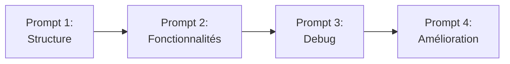

# Workflow Complet avec Claude Code

## 🎯 Ce que vous allez apprendre

- Décomposer une feature en sous-tâches claires
- Structurer des prompts efficaces
- Itérer et débugger avec Claude Code
- Comparer Claude Code et d'autres outils (Lovable, Cursor)
- Appliquer les patterns de prompts qui fonctionnent
- Éviter les erreurs courantes dans vos prompts

## Pourquoi c'est important

Claude Code est un **accélérateur puissant**, mais il nécessite une méthodologie :
- **Bons prompts** = code de qualité rapidement
- **Mauvais prompts** = itérations multiples et frustration

:::tip Analogie ML
Comme pour entraîner un modèle, la qualité des prompts (vos "données d'entraînement") détermine la qualité du code généré.
:::

## Méthodologie : Du besoin au code

### 1. Décomposer la feature

Exemple : "Créer une page d'historique des annotations"

**Décomposition** :
1. Backend : endpoint `/api/annotations/history`
2. Frontend : custom hook `useAnnotationHistory`
3. Frontend : composant `AnnotationHistoryPage`
4. Frontend : filtres (par date, par annotateur)
5. Frontend : tableau avec tri et pagination
6. Frontend : route dans `App.jsx`

### 2. Séquencer les prompts

**Principe** : Du général au spécifique



### 3. Tester et itérer

Après chaque génération :
1. **Lire** le code généré
2. **Tester** dans le navigateur
3. **Identifier** les problèmes
4. **Corriger** avec un prompt ciblé

## Patterns de prompts efficaces

### Pattern 1 : Prompt initial structuré

```
Je veux créer [FONCTIONNALITÉ].

Contexte :
- [Stack technique]
- [Intégration existante]
- [Contraintes spécifiques]

Crée :
1. [Fichier/composant 1]
2. [Fichier/composant 2]
3. [Configuration/route]

Spécifications :
- [Détail 1]
- [Détail 2]

Style : [Librairie UI, approche]
```

**Exemple concret** :
```
Je veux créer une page "Historique des Annotations" dans mon app React.

Contexte :
- App d'annotation de documents existante
- Backend FastAPI avec endpoint GET /api/annotations/history
- Réponse JSON : liste avec {id, document_text, category, annotated_by, annotated_at, previous_category}
- Utilise déjà React-Bootstrap et le hook useFetch

Crée :
1. Le fichier src/pages/AnnotationHistoryPage.jsx
2. Un composant AnnotationHistoryTable.jsx
3. Ajoute la route dans App.jsx (/history)

Spécifications :
- Tableau avec colonnes : ID, Document (tronqué 50 chars), Catégorie, Annoté par, Date, Type (validé/corrigé)
- Badge vert si validé, bleu si corrigé
- Tri par date (plus récent en premier)
- Gestion loading/error standard

Style : React-Bootstrap, épuré et professionnel
```

### Pattern 2 : Prompt d'ajout de fonctionnalité

```
Ajoute à [COMPOSANT] :
- [Feature 1] : [description précise]
- [Feature 2] : [description précise]
- [Feature 3] : [description précise]

Contraintes :
- [Contrainte technique]
- [Contrainte UX]
```

**Exemple** :
```
Ajoute à AnnotationHistoryPage :
- Un filtre par annotateur : dropdown avec liste des annotateurs uniques
- Un filtre par date : date picker pour filtrer les annotations après une date
- Un indicateur visuel : icône différente quand la catégorie a été modifiée vs juste validée
- Export CSV : bouton qui exporte les données filtrées

Contraintes :
- Les filtres doivent être cumulatifs (appliqués ensemble)
- Le compteur de résultats doit refléter les filtres
- L'export CSV doit inclure toutes les colonnes sauf Actions
```

### Pattern 3 : Prompt de debug

```
J'ai cette erreur :
[MESSAGE D'ERREUR EXACT]

Elle vient de [LOCALISATION].

Contexte :
[CE QUE VOUS FAISIEZ QUAND L'ERREUR EST SURVENUE]

Corrige le problème en [APPROCHE SOUHAITÉE].
```

**Exemple** :
```
J'ai cette erreur :
"Cannot read property 'map' of undefined"

Elle vient de la ligne 45 dans AnnotationHistoryPage.jsx :
{history.data.map(item => ...)}

Contexte :
L'erreur apparaît au chargement initial de la page, avant que les données ne soient récupérées de l'API.

Corrige le problème en ajoutant les vérifications nécessaires pour gérer le cas où data est null/undefined pendant le chargement.
```

### Pattern 4 : Prompt d'amélioration UX/UI

```
Le composant [NOM] fonctionne mais [PROBLÈME UX].

Améliore l'UI/UX en :
- [Amélioration 1]
- [Amélioration 2]
- [Amélioration 3]

Garde la logique existante intacte.
```

**Exemple** :
```
Le composant AnnotationHistoryTable fonctionne mais le tableau est trop chargé visuellement.

Améliore l'UI/UX en :
- Tronquant le texte des documents à 50 caractères avec "..." et tooltip au survol
- Utilisant des badges colorés pour les catégories (chaque catégorie une couleur)
- Ajoutant une icône selon le type d'action : ✓ validé, ✏️ corrigé
- Formatant les dates en français format court (ex: "21/11/2024")
- Ajoutant des lignes alternées pour faciliter la lecture

Garde la logique existante (tri, filtres) intacte.
```

### Pattern 5 : Prompt de refactoring

```
Refactore [COMPOSANT/FONCTION] pour :
- [Objectif 1]
- [Objectif 2]

Le comportement doit rester identique.
```

**Exemple** :
```
Refactore AnnotationHistoryPage pour :
- Extraire la logique de filtrage dans un custom hook useAnnotationFilters
- Extraire le composant des filtres dans FilterBar.jsx
- Utiliser useReducer au lieu de plusieurs useState pour l'état des filtres

Le comportement et l'UI doivent rester identiques.
```

## Exemple complet : Feature "Historique des Annotations"

Créons cette feature étape par étape avec Claude Code.

### Étape 1 : Structure initiale

**Prompt** :
```
Je veux créer une page "Historique des Annotations" dans mon app React d'annotation de documents.

Contexte :
- App React avec Vite + React-Bootstrap
- Backend FastAPI sur port 8000
- Endpoint existant : GET /api/annotations/history
- Retourne : [{id, document_text, category, annotated_by, annotated_at, previous_category}]
- J'ai déjà un hook useFetch dans src/hooks/useFetch.js

Crée :
1. src/pages/AnnotationHistoryPage.jsx
2. Ajoute la route /history dans src/App.jsx
3. Ajoute un lien "Historique" dans la navbar

Spécifications :
- Tableau Bootstrap avec colonnes : ID, Document, Catégorie, Annoté par, Date
- Gestion loading (Spinner) et error (Alert)
- Document tronqué à 50 caractères
- Style professionnel avec React-Bootstrap
```

**Résultat attendu** : Claude génère les 3 fichiers avec la structure de base.

### Étape 2 : Ajouter les fonctionnalités

**Prompt** :
```
Ajoute à AnnotationHistoryPage les fonctionnalités suivantes :

1. Filtre par annotateur : dropdown qui liste tous les annotateurs uniques
2. Filtre par statut : dropdown (tous / validé / corrigé)
3. Filtre par date : date input pour voir annotations après une date
4. Compteur de résultats : affiche "X résultat(s)" qui change avec les filtres
5. Indicateur de type : badge vert "Validé" si previous_category est null, badge bleu "Corrigé" sinon

Les filtres doivent être cumulatifs (appliqués ensemble).
Ajoute une section au-dessus du tableau pour les filtres.
```

### Étape 3 : Debug (si erreur)

**Prompt** :
```
J'ai une erreur quand je sélectionne un annotateur dans le filtre :
"Cannot filter on undefined"

Cela vient de la ligne où on fait :
const filtered = data.filter(item => item.annotated_by === selectedAnnotator)

Le problème est que certains items dans data n'ont pas de propriété annotated_by.

Corrige en gérant les valeurs undefined/null dans le filtre.
```

### Étape 4 : Amélioration UI

**Prompt** :
```
Le tableau fonctionne mais l'UI peut être améliorée :

- Formate les dates en français (format court : JJ/MM/AAAA HH:MM)
- Ajoute un tooltip au survol du document tronqué qui affiche le texte complet
- Utilise des badges colorés pour les catégories (Technology=bleu, Finance=vert, Sport=orange, Politics=rouge)
- Ajoute des icônes aux badges de type : ✓ pour Validé, ✏️ pour Corrigé
- Ajoute un bouton "Réinitialiser filtres" qui remet tous les filtres à leur valeur par défaut

Améliore aussi le layout : filtres en Grid Bootstrap (3 colonnes sur desktop).
```

### Étape 5 : Fonctionnalité avancée

**Prompt** :
```
Ajoute un bouton "Exporter CSV" qui :
- Exporte les données filtrées actuelles (pas toutes les données)
- Inclut toutes les colonnes : ID, Document, Catégorie, Annoté par, Date, Type
- Échappe correctement les virgules et guillemets dans les textes
- Nom du fichier : annotations_history_YYYY-MM-DD.csv
- Place le bouton à côté du compteur de résultats
```

## Claude Code vs autres outils

### Comparaison

| Critère | Claude Code | Cursor | Lovable | GitHub Copilot |
|---------|-------------|--------|---------|----------------|
| **Contrôle du code** | ⭐⭐⭐⭐⭐ | ⭐⭐⭐⭐⭐ | ⭐⭐ | ⭐⭐⭐⭐ |
| **Vitesse de génération** | ⭐⭐⭐⭐ | ⭐⭐⭐⭐ | ⭐⭐⭐⭐⭐ | ⭐⭐⭐ |
| **Personnalisation** | ⭐⭐⭐⭐⭐ | ⭐⭐⭐⭐⭐ | ⭐⭐⭐ | ⭐⭐⭐ |
| **Code local** | ✅ | ✅ | ❌ | ✅ |
| **Explicabilité** | ⭐⭐⭐⭐⭐ | ⭐⭐⭐⭐ | ⭐⭐⭐ | ⭐⭐ |
| **Itération** | ⭐⭐⭐⭐⭐ | ⭐⭐⭐⭐ | ⭐⭐⭐ | ⭐⭐⭐ |
| **Apprentissage** | ⭐⭐⭐⭐ | ⭐⭐⭐⭐ | ⭐⭐⭐⭐⭐ | ⭐⭐⭐ |

### Quand utiliser quoi ?

**Claude Code** :
- ✅ Projet professionnel avec besoin de personnalisation
- ✅ Apprentissage et compréhension du code
- ✅ Debugging complexe
- ✅ Contrôle total sur l'architecture

**Cursor** :
- ✅ Développement rapide avec auto-complétion intelligente
- ✅ Refactoring de code existant
- ✅ Workflow en équipe (git intégré)

**Lovable** :
- ✅ Prototypage ultra-rapide
- ✅ Démos pour clients
- ✅ MVP en quelques heures
- ❌ Production (pas de code local)

**GitHub Copilot** :
- ✅ Auto-complétion dans votre IDE
- ✅ Snippets rapides
- ❌ Génération de composants complets

### Workflow recommandé

1. **Prototypage** : Lovable (si besoin de démo rapide)
2. **Développement** : Claude Code (génération de features)
3. **Complétion** : Cursor/Copilot (auto-complétion au quotidien)
4. **Debug** : Claude Code (explications détaillées)

## Best Practices pour les prompts

### ✅ Bon prompt

```
Crée un composant React AnnotationCard qui :

Fonctionnalité :
- Affiche un document avec sa catégorie prédite et son score
- Props : { document: {id, text, category, score}, onValidate, onCorrect }

UI :
- Card Bootstrap avec header (titre + score) et body (texte)
- Badge coloré selon le score : >80%=vert, >60%=orange, sinon rouge
- Footer avec 2 boutons : "Valider" (variant success) et "Corriger" (dropdown)

Comportement :
- Cliquer "Valider" appelle onValidate(document.id)
- Dropdown "Corriger" liste les catégories : Technology, Finance, Sport, Politics
- Sélectionner une catégorie appelle onCorrect(document.id, newCategory)

Style :
- Responsive (pleine largeur sur mobile, col-md-6 sur desktop)
- Texte tronqué à 100 caractères avec "..." si trop long
```

### ❌ Mauvais prompt

```
Fais-moi un truc pour annoter des documents avec des boutons et des couleurs
```

**Problèmes** :
- Pas de contexte technique
- Pas de spécifications claires
- Pas de contraintes de style
- Trop vague

### Checklist d'un bon prompt

- [ ] **Contexte** : Stack, intégrations existantes
- [ ] **Objectif** : Que voulez-vous créer ?
- [ ] **Spécifications** : Fonctionnalités détaillées
- [ ] **Contraintes** : Style, librairies, structure
- [ ] **Format** : Quels fichiers créer/modifier ?

## Debug assisté par IA

### Partager les erreurs efficacement

**Format** :
```
Erreur : [MESSAGE EXACT]
Fichier : [CHEMIN]
Ligne : [NUMÉRO]

Code concerné :
[SNIPPET DE CODE]

Ce que j'ai essayé :
[VOS TENTATIVES]

Attendu vs Réel :
Attendu : [COMPORTEMENT SOUHAITÉ]
Réel : [CE QUI SE PASSE]
```

**Exemple** :
```
Erreur : "Warning: Each child in a list should have a unique "key" prop"
Fichier : src/components/DocumentList.jsx
Ligne : 23

Code concerné :
{documents.map(doc => (
  <DocumentItem document={doc} />
))}

Ce que j'ai essayé :
- Ajouté key={doc.id} mais j'ai toujours l'erreur

Attendu vs Réel :
Attendu : Pas de warning
Réel : Warning dans la console à chaque render
```

### Demander des explications

```
Explique-moi ce code ligne par ligne :

[COLLER LE CODE]

Particulièrement :
- Pourquoi utilise-t-on useMemo ici ?
- Que fait exactement le spread operator {...prev} ?
- Pourquoi le tableau de dépendances est vide [] ?
```

## Tests avec Claude Code

**Prompt pour générer des tests** :
```
Génère des tests Jest + React Testing Library pour le composant AnnotationCard.

Tests à couvrir :
1. Rendu correct avec toutes les props
2. Badge vert si score > 0.8
3. Badge orange si score entre 0.6 et 0.8
4. Badge rouge si score < 0.6
5. Clic sur "Valider" appelle onValidate avec le bon ID
6. Sélection d'une catégorie dans "Corriger" appelle onCorrect

Utilise des mocks pour les fonctions onValidate et onCorrect.
```

## 🤖 Prompts récapitulatifs

### Prompt initial (structure)
```
Crée [FEATURE] dans mon app React.

Contexte : [stack, backend, intégrations]

Crée : [liste de fichiers]

Spécifications : [détails fonctionnels]

Style : [librairie UI, approche]
```

### Prompt d'ajout
```
Ajoute à [COMPOSANT] : [features]

Contraintes : [techniques, UX]
```

### Prompt de debug
```
Erreur : [message]
Localisation : [fichier:ligne]
Contexte : [ce que je faisais]

Corrige en [approche].
```

### Prompt d'amélioration
```
[COMPOSANT] fonctionne mais [problème].

Améliore en : [améliorations]

Garde [ce qui doit rester].
```

## ⚠️ Pièges à éviter

**1. Prompts trop vagues**
```
// ❌ FAUX
Fais-moi une page d'annotation

// ✅ BON
Crée une page d'annotation avec liste de documents, badges de score, boutons valider/corriger
```

**2. Ne pas donner le contexte**
```
// ❌ FAUX
Crée un composant Card

// ✅ BON
Crée un composant Card React avec React-Bootstrap qui s'intègre dans mon app existante (Vite + TypeScript)
```

**3. Tout demander d'un coup**
```
// ❌ FAUX
Crée une app complète avec auth, dashboard, CRUD, export, tests

// ✅ BON
Étape 1 : Crée la structure de base
Étape 2 : Ajoute l'auth
Étape 3 : Ajoute le dashboard
...
```

**4. Accepter sans comprendre**
```
// ❌ FAUX
[Copier-coller le code généré sans le lire]

// ✅ BON
1. Lire le code
2. Poser des questions si pas clair
3. Tester
4. Modifier si nécessaire
```

**5. Ne pas tester après génération**
```
// ❌ FAUX
Générer 10 composants d'affilée sans tester

// ✅ BON
Générer 1 composant → Tester → Corriger → Suivant
```

## 🔗 Ressources

- [Claude Code Documentation](https://claude.ai/code)
- [Prompt Engineering Guide](https://www.promptingguide.ai/)
- [React Best Practices](https://react.dev/learn)

## ➡️ Prochaine étape

Félicitations ! Vous avez maintenant toutes les compétences pour créer des interfaces React professionnelles avec l'aide de l'IA.

👉 [Conclusion](/conclusion)
