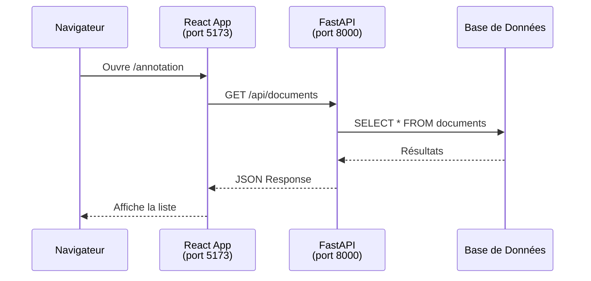

# Intégration API FastAPI

## 🎯 Ce que vous allez apprendre

- Créer un backend FastAPI minimal pour votre frontend
- Configurer CORS pour le développement local
- Créer un hook personnalisé `useFetch` pour les appels API
- Gérer les états de chargement, erreur et données
- Utiliser les variables d'environnement proprement

## Architecture React ↔ FastAPI



**Ports par défaut** :
- React (Vite) : 5173
- FastAPI : 8000

## Backend FastAPI minimal

Créons un backend FastAPI simple avec des endpoints pour notre application d'annotation.

### Installation FastAPI

```bash
# Dans un dossier séparé (ex: backend/)
pip install fastapi uvicorn python-multipart
```

### main.py - Backend complet

```python title="backend/main.py"
from fastapi import FastAPI
from fastapi.middleware.cors import CORSMiddleware
from pydantic import BaseModel
from typing import List

app = FastAPI(title="AnnotaTool API")

# ⚠️ Configuration CORS pour le développement
app.add_middleware(
    CORSMiddleware,
    allow_origins=["http://localhost:5173"],  # Port Vite par défaut
    allow_credentials=True,
    allow_methods=["*"],
    allow_headers=["*"],
)

# Modèle de données
class Document(BaseModel):
    id: int
    text: str
    predicted_category: str
    confidence_score: float
    status: str = "pending"  # pending, validated, corrected

# Données mockées (en production: BDD)
documents_db = [
    {
        "id": 1,
        "text": "L'intelligence artificielle transforme le monde de la tech...",
        "predicted_category": "Technology",
        "confidence_score": 0.95,
        "status": "pending"
    },
    {
        "id": 2,
        "text": "Les marchés financiers ont connu une forte hausse...",
        "predicted_category": "Finance",
        "confidence_score": 0.78,
        "status": "pending"
    },
    {
        "id": 3,
        "text": "Le match de football a été remporté par...",
        "predicted_category": "Sport",
        "confidence_score": 0.62,
        "status": "pending"
    },
]

@app.get("/")
def root():
    return {"message": "AnnotaTool API"}

@app.get("/api/documents", response_model=List[Document])
def get_documents():
    """Récupérer tous les documents"""
    return documents_db

@app.get("/api/documents/{doc_id}", response_model=Document)
def get_document(doc_id: int):
    """Récupérer un document spécifique"""
    doc = next((d for d in documents_db if d["id"] == doc_id), None)
    if not doc:
        raise HTTPException(status_code=404, detail="Document not found")
    return doc

@app.put("/api/documents/{doc_id}", response_model=Document)
def update_document(doc_id: int, document: Document):
    """Mettre à jour un document"""
    for i, doc in enumerate(documents_db):
        if doc["id"] == doc_id:
            documents_db[i] = document.dict()
            return document
    raise HTTPException(status_code=404, detail="Document not found")

@app.post("/api/annotations/bulk")
def save_annotations(annotations: List[dict]):
    """Sauvegarder plusieurs annotations en une fois"""
    # En production: sauvegarder en BDD
    for annotation in annotations:
        doc_id = annotation.get("id")
        for doc in documents_db:
            if doc["id"] == doc_id:
                doc.update(annotation)
    return {"message": f"Saved {len(annotations)} annotations"}

@app.get("/api/stats")
def get_stats():
    """Récupérer les statistiques d'annotation"""
    return {
        "total_annotations": 1247,
        "avg_confidence": 0.87,
        "by_category": [
            {"category": "Technology", "count": 450},
            {"category": "Finance", "count": 320},
            {"category": "Sport", "count": 280},
            {"category": "Politics", "count": 197}
        ],
        "timeline": [
            {"date": "2024-11-15", "count": 45},
            {"date": "2024-11-16", "count": 52},
            {"date": "2024-11-17", "count": 48},
            {"date": "2024-11-18", "count": 61},
            {"date": "2024-11-19", "count": 55},
            {"date": "2024-11-20", "count": 58},
            {"date": "2024-11-21", "count": 63},
        ],
    }

if __name__ == "__main__":
    import uvicorn
    uvicorn.run(app, host="0.0.0.0", port=8000)
```

### Lancer le backend

```bash
# Depuis le dossier backend/
python -m uvicorn main:app --reload

# Ou directement:
python main.py
```

Testez l'API : http://localhost:8000/docs (Swagger UI auto-généré)

:::tip Documentation auto-générée
FastAPI génère automatiquement une documentation interactive ! Très pratique pour tester vos endpoints.
:::

## Custom Hook useFetch côté React

Créons un hook réutilisable pour faire des appels API proprement.

### src/hooks/useFetch.js

```javascript title="src/hooks/useFetch.js"
import { useState, useEffect } from 'react';

export function useFetch(url, options = {}) {
  const [data, setData] = useState(null);
  const [loading, setLoading] = useState(true);
  const [error, setError] = useState(null);

  useEffect(() => {
    const fetchData = async () => {
      setLoading(true);
      setError(null);

      try {
        // Utiliser la variable d'environnement pour l'URL de base
        const baseUrl = import.meta.env.VITE_API_URL || 'http://localhost:8000';
        const fullUrl = `${baseUrl}${url}`;

        const response = await fetch(fullUrl, {
          headers: {
            'Content-Type': 'application/json',
            ...options.headers,
          },
          ...options,
        });

        if (!response.ok) {
          throw new Error(`HTTP error! status: ${response.status}`);
        }

        const json = await response.json();
        setData(json);
      } catch (err) {
        setError(err.message);
        console.error('Fetch error:', err);
      } finally {
        setLoading(false);
      }
    };

    fetchData();
  }, [url]); // Re-fetch si l'URL change

  return { data, loading, error };
}
```

### Utilisation du hook

```jsx title="src/pages/AnnotationPage.jsx"
import { Container, Spinner, Alert } from 'react-bootstrap';
import { useFetch } from '../hooks/useFetch';

function AnnotationPage() {
  const { data: documents, loading, error } = useFetch('/api/documents');

  // Affichage conditionnel basé sur l'état
  if (loading) {
    return (
      <Container className="my-4 text-center">
        <Spinner animation="border" role="status">
          <span className="visually-hidden">Chargement...</span>
        </Spinner>
        <p className="mt-2">Chargement des documents...</p>
      </Container>
    );
  }

  if (error) {
    return (
      <Container className="my-4">
        <Alert variant="danger">
          <Alert.Heading>Erreur de chargement</Alert.Heading>
          <p>{error}</p>
          <p className="mb-0">
            Vérifiez que le backend FastAPI est bien lancé sur le port 8000.
          </p>
        </Alert>
      </Container>
    );
  }

  return (
    <Container className="my-4">
      <h1>Annotation de Documents</h1>
      <p className="text-muted">
        {documents?.length || 0} document(s) à annoter
      </p>

      <div className="mt-4">
        {documents?.map((doc) => (
          <div key={doc.id} className="card mb-3">
            <div className="card-body">
              <h5 className="card-title">Document #{doc.id}</h5>
              <p className="card-text">{doc.text}</p>
              <div className="d-flex gap-2">
                <span className="badge bg-primary">
                  {doc.predicted_category}
                </span>
                <span className="badge bg-secondary">
                  {(doc.confidence_score * 100).toFixed(0)}% confiance
                </span>
              </div>
            </div>
          </div>
        ))}
      </div>
    </Container>
  );
}

export default AnnotationPage;
```

## Configuration des variables d'environnement

### .env.local (React)

```bash title=".env.local"
VITE_API_URL=http://localhost:8000
```

:::warning .gitignore
Ajoutez `.env.local` à votre `.gitignore` pour ne pas commiter vos secrets !
:::

### Utilisation

```javascript
const apiUrl = import.meta.env.VITE_API_URL;
console.log(apiUrl); // http://localhost:8000
```

## Gestion d'erreur robuste

```jsx title="src/components/ErrorBoundary.jsx"
import { Alert } from 'react-bootstrap';

export function ErrorDisplay({ error, retry }) {
  return (
    <Alert variant="danger">
      <Alert.Heading>Une erreur est survenue</Alert.Heading>
      <p>{error}</p>
      {retry && (
        <button onClick={retry} className="btn btn-sm btn-outline-danger">
          Réessayer
        </button>
      )}
    </Alert>
  );
}

export function LoadingSpinner({ message = "Chargement..." }) {
  return (
    <div className="text-center my-5">
      <Spinner animation="border" />
      <p className="mt-2 text-muted">{message}</p>
    </div>
  );
}
```

## Appels API avec POST/PUT

### Hook useMutation pour les mutations

```javascript title="src/hooks/useMutation.js"
import { useState } from 'react';

export function useMutation(url, options = {}) {
  const [loading, setLoading] = useState(false);
  const [error, setError] = useState(null);

  const mutate = async (data) => {
    setLoading(true);
    setError(null);

    try {
      const baseUrl = import.meta.env.VITE_API_URL || 'http://localhost:8000';
      const fullUrl = `${baseUrl}${url}`;

      const response = await fetch(fullUrl, {
        method: options.method || 'POST',
        headers: {
          'Content-Type': 'application/json',
          ...options.headers,
        },
        body: JSON.stringify(data),
        ...options,
      });

      if (!response.ok) {
        throw new Error(`HTTP error! status: ${response.status}`);
      }

      const result = await response.json();
      return result;
    } catch (err) {
      setError(err.message);
      throw err;
    } finally {
      setLoading(false);
    }
  };

  return { mutate, loading, error };
}
```

### Utilisation

```jsx
import { useMutation } from '../hooks/useMutation';

function AnnotationForm() {
  const { mutate, loading, error } = useMutation('/api/annotations/bulk');

  const handleSave = async () => {
    try {
      const result = await mutate([
        { id: 1, status: 'validated' },
        { id: 2, status: 'corrected', category: 'Technology' },
      ]);
      console.log('Sauvegardé:', result);
    } catch (err) {
      console.error('Erreur:', err);
    }
  };

  return (
    <button onClick={handleSave} disabled={loading}>
      {loading ? 'Sauvegarde...' : 'Sauvegarder'}
    </button>
  );
}
```

## 🤖 Prompts Claude Code recommandés

```
Crée un hook React personnalisé useFetch qui :
- Prend une URL en paramètre
- Retourne { data, loading, error }
- Gère automatiquement les états de chargement et d'erreur
- Utilise useEffect pour effectuer le fetch
- Préfixe l'URL avec import.meta.env.VITE_API_URL
```

```
Crée une page React qui :
- Utilise useFetch pour récupérer /api/documents
- Affiche un Spinner pendant le chargement
- Affiche une Alert en cas d'erreur
- Affiche la liste des documents une fois chargés
- Utilise React-Bootstrap pour l'UI
```

## ⚠️ Pièges à éviter

**1. Oublier les dépendances dans useEffect**
```javascript
// ❌ FAUX - url n'est pas dans les dépendances
useEffect(() => {
  fetch(url)...
}, []);

// ✅ BON
useEffect(() => {
  fetch(url)...
}, [url]);
```

**2. Ne pas gérer les états de chargement/erreur**
```jsx
// ❌ FAUX - pas de feedback utilisateur
const { data } = useFetch('/api/documents');
return <div>{data.map(...)}</div>; // ❌ data peut être null !

// ✅ BON
const { data, loading, error } = useFetch('/api/documents');
if (loading) return <Spinner />;
if (error) return <Alert>{error}</Alert>;
return <div>{data?.map(...)}</div>;
```

**3. Hardcoder l'URL de l'API**
```javascript
// ❌ FAUX
fetch('http://localhost:8000/api/documents')

// ✅ BON
const baseUrl = import.meta.env.VITE_API_URL;
fetch(`${baseUrl}/api/documents`)
```

**4. Oublier CORS sur le backend**
```python
# ❌ Sans CORS, le navigateur bloque les requêtes
app = FastAPI()

# ✅ Avec CORS configuré
app.add_middleware(
    CORSMiddleware,
    allow_origins=["http://localhost:5173"],
    allow_methods=["*"],
)
```

## 🔗 Ressources

- [FastAPI Documentation](https://fastapi.tiangolo.com/)
- [FastAPI CORS](https://fastapi.tiangolo.com/tutorial/cors/)
- [Fetch API](https://developer.mozilla.org/en-US/docs/Web/API/Fetch_API)
- [React Hooks](https://react.dev/reference/react)

## ➡️ Prochaine étape

Maintenant que vous savez connecter React et FastAPI, créons notre première interface métier : l'interface d'annotation !

👉 [Section 4 : Interface d'Annotation](/interfaces/section-4-annotation)
