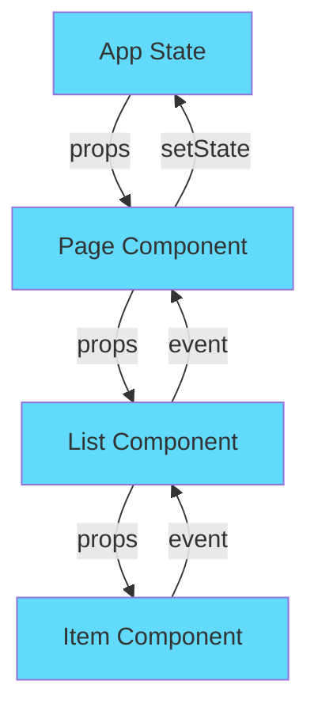

# Rappels React et Structure de Projet

## 🎯 Ce que vous allez apprendre

- Les concepts React essentiels (composants, props, state, hooks)
- Comment structurer un projet React de manière maintenable
- Les conventions de nommage et l'architecture recommandée
- Le flow de données dans une application React

## Pourquoi c'est important

Avant de plonger dans le code, il est crucial de comprendre les fondamentaux de React. Cette section vous donne les concepts minimums nécessaires pour être productif, sans vous noyer dans la théorie.

:::tip Analogie backend
Si vous connaissez FastAPI, React c'est comme construire une API, mais pour l'interface utilisateur. Les composants sont comme des endpoints, les props comme des paramètres de requête, et le state comme une base de données locale.
:::

## Concepts React essentiels

### Composants fonctionnels

Un **composant** est une fonction JavaScript qui retourne du JSX (HTML amélioré). C'est l'unité de base de React.

```jsx
// Composant simple
function Greeting() {
  return <h1>Bonjour !</h1>;
}

// Composant avec logique
function WelcomeMessage() {
  const userName = "Alice";
  const hour = new Date().getHours();
  const greeting = hour < 12 ? "Bonjour" : "Bonsoir";

  return (
    <div>
      <h1>{greeting}, {userName} !</h1>
      <p>Il est {hour}h</p>
    </div>
  );
}
```

:::note JSX
JSX ressemble à du HTML mais c'est du JavaScript. Les accolades `{}` permettent d'insérer des expressions JavaScript.
:::

### Props : passer des données

Les **props** permettent de passer des données d'un composant parent vers un composant enfant. C'est **unidirectionnel** (parent → enfant uniquement).

```jsx
// Composant enfant qui reçoit des props
function DocumentCard({ title, score, category }) {
  return (
    <div className="card">
      <h3>{title}</h3>
      <p>Catégorie: {category}</p>
      <p>Score: {score}%</p>
    </div>
  );
}

// Composant parent qui passe des props
function DocumentList() {
  return (
    <div>
      <DocumentCard
        title="Article ML"
        score={95}
        category="Technology"
      />
      <DocumentCard
        title="Rapport Q4"
        score={78}
        category="Finance"
      />
    </div>
  );
}
```

:::tip Équivalent Python
```python
# En Python, ce serait comme:
def document_card(title: str, score: int, category: str):
    return f"<div>{title} - {category}: {score}%</div>"
```
:::

### State : gérer les données locales

Le **state** est la mémoire d'un composant. Quand le state change, React re-rend automatiquement le composant.

```jsx
import { useState } from 'react';

function Counter() {
  // Déclarer un state avec useState
  const [count, setCount] = useState(0); // valeur initiale = 0

  return (
    <div>
      <p>Compte: {count}</p>
      <button onClick={() => setCount(count + 1)}>
        Incrémenter
      </button>
      <button onClick={() => setCount(0)}>
        Réinitialiser
      </button>
    </div>
  );
}
```

**Règle importante** : Ne jamais modifier directement le state. Toujours utiliser la fonction `setXxx`.

```jsx
// ❌ FAUX - mutation directe
count = count + 1;

// ✅ BON - utiliser le setter
setCount(count + 1);
```

### Hooks : useEffect pour les effets de bord

`useEffect` permet d'exécuter du code après le rendu (appels API, timers, etc.).

```jsx
import { useState, useEffect } from 'react';

function DocumentLoader() {
  const [documents, setDocuments] = useState([]);
  const [loading, setLoading] = useState(true);

  useEffect(() => {
    // Ce code s'exécute après le premier rendu
    fetch('/api/documents')
      .then(res => res.json())
      .then(data => {
        setDocuments(data);
        setLoading(false);
      });
  }, []); // [] = exécuter une seule fois au montage

  if (loading) return <p>Chargement...</p>;

  return (
    <ul>
      {documents.map(doc => <li key={doc.id}>{doc.title}</li>)}
    </ul>
  );
}
```

:::warning Dépendances useEffect
Le tableau de dépendances `[]` contrôle quand l'effet se ré-exécute :
- `[]` : une seule fois au montage
- `[count]` : à chaque changement de `count`
- Pas de tableau : à chaque rendu (souvent une erreur !)
:::

### Rendu conditionnel et listes

```jsx
function DocumentItem({ document, isValidated }) {
  return (
    <div>
      <h3>{document.title}</h3>

      {/* Rendu conditionnel */}
      {isValidated ? (
        <span className="badge success">✓ Validé</span>
      ) : (
        <span className="badge pending">En attente</span>
      )}

      {/* Opérateur && : afficher seulement si true */}
      {document.score > 0.9 && (
        <span className="badge high-confidence">Haute confiance</span>
      )}
    </div>
  );
}

function DocumentList({ documents }) {
  return (
    <div>
      {/* Rendu de liste avec .map() */}
      {documents.map((doc) => (
        <DocumentItem
          key={doc.id}  // ⚠️ key obligatoire pour les listes
          document={doc}
          isValidated={doc.status === 'validated'}
        />
      ))}

      {/* Afficher message si liste vide */}
      {documents.length === 0 && (
        <p>Aucun document à afficher</p>
      )}
    </div>
  );
}
```

:::danger Key dans les listes
Toujours ajouter un `key` unique lors du rendu de listes. Utilisez l'ID de l'objet, jamais l'index du tableau.
:::

## Structure d'un projet React multi-pages

Voici la structure recommandée pour un projet d'annotation/visualisation :

```
src/
├── components/
│   ├── common/              # Composants réutilisables
│   │   ├── Button.jsx      # Bouton personnalisé
│   │   ├── Card.jsx        # Card générique
│   │   ├── Spinner.jsx     # Indicateur de chargement
│   │   └── Badge.jsx       # Badge de statut
│   │
│   ├── layout/              # Composants de mise en page
│   │   ├── NavBar.jsx      # Barre de navigation
│   │   ├── Sidebar.jsx     # Menu latéral
│   │   └── Footer.jsx      # Pied de page
│   │
│   └── annotation/          # Composants métier (spécifiques)
│       ├── DocumentList.jsx       # Liste de documents
│       ├── DocumentItem.jsx       # Item individuel
│       ├── AnnotationForm.jsx     # Formulaire d'annotation
│       └── ConfidenceBadge.jsx    # Badge de score
│
├── pages/                   # Pages complètes (routes)
│   ├── HomePage.jsx        # Page d'accueil
│   ├── AnnotationPage.jsx  # Page d'annotation
│   ├── DashboardPage.jsx   # Dashboard de stats
│   └── NotFoundPage.jsx    # Page 404
│
├── hooks/                   # Custom hooks (logique réutilisable)
│   ├── useFetch.js         # Hook pour appels API
│   ├── useAuth.js          # Hook d'authentification
│   └── useLocalStorage.js  # Hook pour localStorage
│
├── utils/                   # Fonctions utilitaires
│   ├── api.js              # Client API (fetch wrapper)
│   ├── formatters.js       # Formatage dates, nombres
│   └── constants.js        # Constantes globales
│
├── App.jsx                  # Point d'entrée, définit les routes
└── main.jsx                 # Bootstrap de l'app
```

### Explications de la structure

**components/common** : Composants génériques réutilisables dans tout le projet (boutons, cards, spinners). Pas de logique métier.

**components/layout** : Structure de la page (navbar, sidebar, footer). Utilisés dans App.jsx pour wrapper les pages.

**components/[domain]** : Composants spécifiques à un domaine métier (ex: annotation). Contiennent la logique métier.

**pages** : Composants de niveau "page", correspondent aux routes. Assemblent plusieurs composants plus petits.

**hooks** : Logique réutilisable extraite dans des custom hooks (ex: `useFetch` pour appeler des APIs).

**utils** : Fonctions pures sans dépendance React (formatage, calculs, constantes).

### Exemple : Arborescence d'une app d'annotation

```jsx
// src/App.jsx - Routes principales
import { BrowserRouter, Routes, Route } from 'react-router-dom';
import NavBar from './components/layout/NavBar';
import HomePage from './pages/HomePage';
import AnnotationPage from './pages/AnnotationPage';
import DashboardPage from './pages/DashboardPage';

function App() {
  return (
    <BrowserRouter>
      <NavBar />
      <div className="container">
        <Routes>
          <Route path="/" element={<HomePage />} />
          <Route path="/annotation" element={<AnnotationPage />} />
          <Route path="/dashboard" element={<DashboardPage />} />
        </Routes>
      </div>
    </BrowserRouter>
  );
}

export default App;
```

```jsx
// src/pages/AnnotationPage.jsx - Page complète
import { useState } from 'react';
import DocumentList from '../components/annotation/DocumentList';
import { useFetch } from '../hooks/useFetch';

function AnnotationPage() {
  const { data: documents, loading } = useFetch('/api/documents');
  const [filter, setFilter] = useState('all');

  if (loading) return <Spinner />;

  const filteredDocs = filter === 'all'
    ? documents
    : documents.filter(d => d.status === filter);

  return (
    <div>
      <h1>Annotation de Documents</h1>

      <FilterBar onFilterChange={setFilter} />

      <DocumentList documents={filteredDocs} />
    </div>
  );
}

export default AnnotationPage;
```

## Flow de données React

Le principe fondamental de React est le **flux de données unidirectionnel** :



**Données descendent (props)** : Parent → Enfant → Petit-enfant

**Événements remontent (callbacks)** : Petit-enfant → Enfant → Parent

```jsx
// Parent
function AnnotationPage() {
  const [documents, setDocuments] = useState([]);

  const handleValidate = (docId) => {
    // Mettre à jour le state
    setDocuments(docs =>
      docs.map(d => d.id === docId ? {...d, validated: true} : d)
    );
  };

  return (
    <DocumentList
      documents={documents}         // ⬇️ Props descendent
      onValidate={handleValidate}   // ⬇️ Callback descend
    />
  );
}

// Enfant
function DocumentList({ documents, onValidate }) {
  return (
    <div>
      {documents.map(doc => (
        <DocumentItem
          key={doc.id}
          document={doc}              // ⬇️ Props descendent
          onValidate={onValidate}     // ⬇️ Callback descend
        />
      ))}
    </div>
  );
}

// Petit-enfant
function DocumentItem({ document, onValidate }) {
  return (
    <div>
      <h3>{document.title}</h3>
      <button onClick={() => onValidate(document.id)}>
        {/* ⬆️ Événement remonte via le callback */}
        Valider
      </button>
    </div>
  );
}
```

## 🤖 Prompts Claude Code recommandés

```
Explique-moi la différence entre props et state en React avec un exemple concret d'interface d'annotation de documents.
```

```
Crée une structure de dossiers React pour une application d'annotation avec :
- Composants de base (Button, Card, Badge)
- Composants spécifiques (DocumentList, AnnotationForm)
- Pages (Annotation, Dashboard)
- Hooks personnalisés (useFetch)
```

```
Écris un composant React DocumentCard qui :
- Reçoit en props : title, category, score, status
- Affiche le titre en h3
- Affiche la catégorie et le score
- Affiche un badge vert si validated, orange si pending
- Utilise des composants React-Bootstrap
```

## ⚠️ Pièges à éviter

**1. Modifier directement le state**
```jsx
// ❌ FAUX
items[0].validated = true;
setItems(items);

// ✅ BON
setItems(items.map((item, i) =>
  i === 0 ? {...item, validated: true} : item
));
```

**2. Oublier les dépendances dans useEffect**
```jsx
// ❌ FAUX - userId n'est pas dans les dépendances
useEffect(() => {
  fetch(`/api/user/${userId}`)...
}, []);

// ✅ BON
useEffect(() => {
  fetch(`/api/user/${userId}`)...
}, [userId]);
```

**3. Utiliser l'index comme key dans les listes**
```jsx
// ❌ FAUX
{items.map((item, index) => <Item key={index} />)}

// ✅ BON
{items.map((item) => <Item key={item.id} />)}
```

**4. Mettre trop de logique dans les composants**
```jsx
// ❌ FAUX - tout dans le composant
function DocumentPage() {
  const [docs, setDocs] = useState([]);
  useEffect(() => {
    fetch('/api/docs').then(...)...
  }, []);
  // ... 100 lignes de logique
}

// ✅ BON - extraire dans un hook
function useFetchDocuments() {
  const [docs, setDocs] = useState([]);
  useEffect(() => {
    fetch('/api/docs').then(...)...
  }, []);
  return { docs, loading, error };
}

function DocumentPage() {
  const { docs, loading } = useFetchDocuments();
  // ... composant plus simple
}
```

## 🔗 Ressources

- [React Official Docs](https://react.dev) - Documentation officielle (excellente !)
- [React Dev Tools](https://react.dev/learn/react-developer-tools) - Extension Chrome/Firefox pour débugger
- [JavaScript.info](https://javascript.info/) - Apprendre JavaScript moderne

## ➡️ Prochaine étape

Maintenant que vous connaissez les fondamentaux, passons au setup d'un projet React moderne avec Vite.

👉 [Section 2 : Setup avec Vite](/fundamentals/section-2-setup-vite)
