# Interface d'Annotation - Liste Scorée

## 🎯 Ce que vous allez apprendre

- Concevoir une interface d'annotation avec prédictions ML
- Créer des badges colorés basés sur les scores de confiance
- Gérer l'état local pour traquer les modifications en cours
- Implémenter la validation et correction en masse
- Sauvegarder les annotations en bulk vers l'API
- Fournir un feedback visuel clair à l'utilisateur

## Pourquoi c'est important

L'annotation de données est au cœur de nombreux projets ML. Une bonne interface d'annotation permet de :
- **Valider rapidement** les prédictions correctes du modèle
- **Corriger efficacement** les erreurs de classification
- **Gagner du temps** avec des actions en masse
- **Suivre la progression** avec des indicateurs visuels

:::tip Cas d'usage typique
Vous avez un modèle de classification de documents qui prédit des catégories avec un score de confiance. Vous voulez une interface pour que vos annotateurs puissent valider les bonnes prédictions et corriger les mauvaises avant de réentraîner le modèle.
:::

## Concepts clés

### Gestion d'état local

L'état local permet de tracker toutes les modifications de l'utilisateur avant la sauvegarde finale :

```jsx
const [annotations, setAnnotations] = useState({});
// Structure : { docId: { action: 'validated' | 'corrected', category?: string } }
```

### Optimistic updates

Au lieu d'attendre la réponse de l'API, on met à jour l'UI immédiatement pour une meilleure expérience utilisateur.

### Sauvegarde bulk

Plutôt que de faire un appel API par document, on envoie toutes les modifications en une seule requête.

## Architecture de l'interface

```mermaid
graph TB
    A[AnnotationPage] -->|fetch| B[Backend API]
    A -->|renders| C[DocumentList]
    C -->|for each| D[DocumentItem]
    D -->|user action| E[État local: annotations]
    E -->|bulk save| B

    style A fill:#61dafb
    style C fill:#61dafb
    style D fill:#61dafb
```



## Exemple pratique : Interface d'annotation complète

### Backend - Endpoints FastAPI

Ajoutons les endpoints nécessaires à notre `main.py` :

```python title="backend/main.py"
from fastapi import FastAPI, HTTPException
from fastapi.middleware.cors import CORSMiddleware
from pydantic import BaseModel
from typing import List

app = FastAPI(title="AnnotaTool API")

# Configuration CORS
app.add_middleware(
    CORSMiddleware,
    allow_origins=["http://localhost:5173"],
    allow_credentials=True,
    allow_methods=["*"],
    allow_headers=["*"],
)

# Modèles
class Document(BaseModel):
    id: int
    text: str
    predicted_category: str
    confidence_score: float
    status: str = "pending"

class Annotation(BaseModel):
    id: int
    action: str  # 'validated' ou 'corrected'
    category: str = None

# Données mockées
documents_db = [
    {
        "id": 1,
        "text": "L'intelligence artificielle transforme le monde de la tech grâce à des algorithmes sophistiqués...",
        "predicted_category": "Technology",
        "confidence_score": 0.95,
        "status": "pending"
    },
    {
        "id": 2,
        "text": "Les marchés financiers ont connu une forte hausse suite aux derniers indicateurs économiques...",
        "predicted_category": "Finance",
        "confidence_score": 0.78,
        "status": "pending"
    },
    {
        "id": 3,
        "text": "Le match de football a été remporté par l'équipe locale avec un score de 3-1...",
        "predicted_category": "Sport",
        "confidence_score": 0.62,
        "status": "pending"
    },
    {
        "id": 4,
        "text": "La nouvelle réforme fiscale sera débattue au parlement la semaine prochaine...",
        "predicted_category": "Politics",
        "confidence_score": 0.88,
        "status": "pending"
    },
    {
        "id": 5,
        "text": "Bitcoin franchit un nouveau record historique dépassant les 100k dollars...",
        "predicted_category": "Technology",  # Mauvaise prédiction !
        "confidence_score": 0.45,
        "status": "pending"
    },
]

@app.get("/api/documents", response_model=List[Document])
def get_documents():
    """Récupérer tous les documents à annoter"""
    return documents_db

@app.post("/api/annotations/bulk")
def save_annotations(annotations: List[Annotation]):
    """Sauvegarder plusieurs annotations en une fois"""
    updated_count = 0

    for annotation in annotations:
        for doc in documents_db:
            if doc["id"] == annotation.id:
                if annotation.action == "validated":
                    doc["status"] = "validated"
                elif annotation.action == "corrected":
                    doc["status"] = "corrected"
                    if annotation.category:
                        doc["predicted_category"] = annotation.category
                updated_count += 1
                break

    return {
        "message": f"Saved {updated_count} annotations",
        "updated": updated_count
    }
```

### Frontend - Composant DocumentItem

Créons d'abord le composant pour un document individuel :

```jsx title="src/components/annotation/DocumentItem.jsx"
import { Badge, Button, Dropdown, ButtonGroup } from 'react-bootstrap';
import './DocumentItem.css';

const CATEGORIES = ['Technology', 'Finance', 'Sport', 'Politics'];

function DocumentItem({ document, annotation, onValidate, onCorrect }) {
  const { id, text, predicted_category, confidence_score, status } = document;

  // Déterminer la couleur du badge selon le score
  const getBadgeVariant = (score) => {
    if (score >= 0.8) return 'success';
    if (score >= 0.6) return 'warning';
    return 'danger';
  };

  // Afficher l'état d'annotation locale
  const getAnnotationBadge = () => {
    if (!annotation) return null;

    if (annotation.action === 'validated') {
      return <Badge bg="success" className="ms-2">✓ Validé</Badge>;
    }

    return (
      <Badge bg="info" className="ms-2">
        ✏️ Corrigé → {annotation.category}
      </Badge>
    );
  };

  return (
    <div className="document-item card mb-3">
      <div className="card-body">
        <div className="d-flex justify-content-between align-items-start">
          <div className="flex-grow-1">
            <p className="document-text mb-2">{text}</p>

            <div className="document-meta">
              <Badge bg={getBadgeVariant(confidence_score)}>
                {predicted_category}
              </Badge>
              <span className="text-muted ms-2">
                {(confidence_score * 100).toFixed(0)}% confiance
              </span>
              {getAnnotationBadge()}
            </div>
          </div>

          <div className="document-actions">
            {!annotation && (
              <ButtonGroup>
                <Button
                  size="sm"
                  variant="outline-success"
                  onClick={() => onValidate(id)}
                >
                  ✓ Valider
                </Button>

                <Dropdown as={ButtonGroup}>
                  <Dropdown.Toggle
                    size="sm"
                    variant="outline-warning"
                    id={`dropdown-${id}`}
                  >
                    ✏️ Corriger
                  </Dropdown.Toggle>
                  <Dropdown.Menu>
                    {CATEGORIES.filter(cat => cat !== predicted_category).map(category => (
                      <Dropdown.Item
                        key={category}
                        onClick={() => onCorrect(id, category)}
                      >
                        {category}
                      </Dropdown.Item>
                    ))}
                  </Dropdown.Menu>
                </Dropdown>
              </ButtonGroup>
            )}

            {annotation && (
              <Button
                size="sm"
                variant="outline-secondary"
                onClick={() => onCorrect(id, null)}
              >
                ↺ Annuler
              </Button>
            )}
          </div>
        </div>
      </div>
    </div>
  );
}

export default DocumentItem;
```

### CSS pour DocumentItem

```css title="src/components/annotation/DocumentItem.css"
.document-item {
  transition: box-shadow 0.2s;
}

.document-item:hover {
  box-shadow: 0 4px 6px rgba(0, 0, 0, 0.1);
}

.document-text {
  font-size: 0.95rem;
  line-height: 1.5;
  color: #333;
}

.document-meta {
  display: flex;
  align-items: center;
  flex-wrap: wrap;
  gap: 0.5rem;
}

.document-actions {
  margin-left: 1rem;
}
```

### Frontend - Page principale d'annotation

Maintenant créons la page complète qui orchestre tout :

```jsx title="src/pages/AnnotationPage.jsx"
import { useState } from 'react';
import { Container, Alert, Button, Spinner, Badge, Row, Col } from 'react-bootstrap';
import { useFetch } from '../hooks/useFetch';
import DocumentItem from '../components/annotation/DocumentItem';

function AnnotationPage() {
  const apiUrl = import.meta.env.VITE_API_URL || 'http://localhost:8000';
  const { data: documents, loading, error } = useFetch(`${apiUrl}/api/documents`);

  const [annotations, setAnnotations] = useState({});
  const [saving, setSaving] = useState(false);
  const [saveSuccess, setSaveSuccess] = useState(false);
  const [saveError, setSaveError] = useState(null);

  // Gérer la validation d'un document
  const handleValidate = (docId) => {
    setAnnotations(prev => ({
      ...prev,
      [docId]: { action: 'validated' }
    }));
  };

  // Gérer la correction d'un document
  const handleCorrect = (docId, newCategory) => {
    if (newCategory === null) {
      // Annuler l'annotation
      setAnnotations(prev => {
        const updated = { ...prev };
        delete updated[docId];
        return updated;
      });
    } else {
      setAnnotations(prev => ({
        ...prev,
        [docId]: { action: 'corrected', category: newCategory }
      }));
    }
  };

  // Sauvegarder toutes les annotations
  const handleSave = async () => {
    setSaving(true);
    setSaveSuccess(false);
    setSaveError(null);

    try {
      const annotationsArray = Object.entries(annotations).map(([id, data]) => ({
        id: parseInt(id),
        action: data.action,
        category: data.category
      }));

      const response = await fetch(`${apiUrl}/api/annotations/bulk`, {
        method: 'POST',
        headers: {
          'Content-Type': 'application/json',
        },
        body: JSON.stringify(annotationsArray)
      });

      if (!response.ok) {
        throw new Error(`Erreur HTTP: ${response.status}`);
      }

      const result = await response.json();
      console.log('Sauvegarde réussie:', result);

      setSaveSuccess(true);
      setAnnotations({}); // Réinitialiser après sauvegarde

      // Masquer le message de succès après 3 secondes
      setTimeout(() => setSaveSuccess(false), 3000);

    } catch (err) {
      console.error('Erreur de sauvegarde:', err);
      setSaveError(err.message);
    } finally {
      setSaving(false);
    }
  };

  // Calculer les statistiques
  const annotationCount = Object.keys(annotations).length;
  const validatedCount = Object.values(annotations).filter(a => a.action === 'validated').length;
  const correctedCount = Object.values(annotations).filter(a => a.action === 'corrected').length;

  // États de chargement et erreur
  if (loading) {
    return (
      <Container className="my-5 text-center">
        <Spinner animation="border" role="status">
          <span className="visually-hidden">Chargement...</span>
        </Spinner>
        <p className="mt-3 text-muted">Chargement des documents...</p>
      </Container>
    );
  }

  if (error) {
    return (
      <Container className="my-4">
        <Alert variant="danger">
          <Alert.Heading>Erreur de chargement</Alert.Heading>
          <p>{error}</p>
          <p className="mb-0">
            Vérifiez que le backend FastAPI est bien lancé sur le port 8000.
          </p>
        </Alert>
      </Container>
    );
  }

  return (
    <Container className="my-4">
      <div className="d-flex justify-content-between align-items-center mb-4">
        <div>
          <h1>Annotation de Documents</h1>
          <p className="text-muted mb-0">
            {documents?.length || 0} document(s) à annoter
          </p>
        </div>

        <Button
          variant="primary"
          onClick={handleSave}
          disabled={annotationCount === 0 || saving}
          size="lg"
        >
          {saving ? (
            <>
              <Spinner
                as="span"
                animation="border"
                size="sm"
                role="status"
                aria-hidden="true"
                className="me-2"
              />
              Sauvegarde...
            </>
          ) : (
            `💾 Sauvegarder (${annotationCount})`
          )}
        </Button>
      </div>

      {/* Messages de feedback */}
      {saveSuccess && (
        <Alert variant="success" dismissible onClose={() => setSaveSuccess(false)}>
          <strong>✓ Succès !</strong> {annotationCount} annotation(s) sauvegardée(s).
        </Alert>
      )}

      {saveError && (
        <Alert variant="danger" dismissible onClose={() => setSaveError(null)}>
          <strong>Erreur de sauvegarde :</strong> {saveError}
        </Alert>
      )}

      {/* Statistiques des annotations en cours */}
      {annotationCount > 0 && (
        <Row className="mb-3">
          <Col>
            <Alert variant="info">
              <strong>Modifications en cours :</strong>{' '}
              <Badge bg="success">{validatedCount} validé(s)</Badge>{' '}
              <Badge bg="info">{correctedCount} corrigé(s)</Badge>
            </Alert>
          </Col>
        </Row>
      )}

      {/* Liste des documents */}
      <div className="document-list">
        {documents?.map((doc) => (
          <DocumentItem
            key={doc.id}
            document={doc}
            annotation={annotations[doc.id]}
            onValidate={handleValidate}
            onCorrect={handleCorrect}
          />
        ))}
      </div>

      {/* Message si liste vide */}
      {documents?.length === 0 && (
        <Alert variant="info">
          Aucun document à annoter pour le moment.
        </Alert>
      )}
    </Container>
  );
}

export default AnnotationPage;
```

### Explications détaillées

#### 1. Gestion de l'état local

```jsx
const [annotations, setAnnotations] = useState({});
```

Cet objet stocke toutes les modifications en cours. Structure :
```javascript
{
  1: { action: 'validated' },
  3: { action: 'corrected', category: 'Finance' },
  5: { action: 'validated' }
}
```

#### 2. Fonctions de gestion

**Validation** : Simple, on marque juste le document comme validé
```jsx
const handleValidate = (docId) => {
  setAnnotations(prev => ({
    ...prev,
    [docId]: { action: 'validated' }
  }));
};
```

**Correction** : On stocke aussi la nouvelle catégorie
```jsx
const handleCorrect = (docId, newCategory) => {
  if (newCategory === null) {
    // Annulation : on retire l'annotation
    const updated = { ...prev };
    delete updated[docId];
    return updated;
  } else {
    return {
      ...prev,
      [docId]: { action: 'corrected', category: newCategory }
    };
  }
};
```

#### 3. Sauvegarde bulk

On transforme l'objet en tableau avant l'envoi :
```jsx
const annotationsArray = Object.entries(annotations).map(([id, data]) => ({
  id: parseInt(id),
  action: data.action,
  category: data.category
}));
```

#### 4. Feedback utilisateur

Trois états possibles :
- `saving` : affiche un spinner pendant la requête
- `saveSuccess` : affiche un message de succès
- `saveError` : affiche un message d'erreur

## 🤖 Prompts Claude Code recommandés

:::tip Générer l'interface complète
```
Crée une interface d'annotation React avec :
- Une liste de documents récupérée depuis GET /api/documents
- Chaque document affiche : texte, catégorie prédite, score de confiance
- Badges colorés selon le score (vert >80%, orange >60%, rouge sinon)
- Boutons "Valider" et "Corriger" (avec dropdown de catégories)
- État local pour tracker les modifications
- Bouton global "Sauvegarder" qui envoie en bulk POST /api/annotations/bulk
- Messages de succès/erreur après sauvegarde
- Utilise React-Bootstrap pour l'UI
```
:::

:::info Améliorer l'UX
```
Améliore l'interface d'annotation en ajoutant :
- Un badge qui affiche le nombre de validations vs corrections en cours
- Une animation de transition quand on valide/corrige
- Un bouton "Annuler" pour retirer une annotation en cours
- Un compteur en temps réel dans le bouton "Sauvegarder"
```
:::

:::tip Ajouter des filtres
```
Ajoute des filtres à la page d'annotation :
- Filtre par statut (tous, pending, validated, corrected)
- Filtre par score de confiance (tous, >80%, 60-80%, <60%)
- Les filtres doivent être des dropdowns Bootstrap
- Le compteur de documents doit refléter les filtres actifs
```
:::

## ⚠️ Pièges à éviter

**1. Ne pas tracker l'état local**
```jsx
// ❌ FAUX - appel API immédiat par document
<Button onClick={() => fetch('/api/validate', { body: docId })}>
  Valider
</Button>

// ✅ BON - accumulation locale puis bulk save
<Button onClick={() => handleValidate(docId)}>
  Valider
</Button>
```

**2. Envoyer une requête par annotation**
```jsx
// ❌ FAUX - N requêtes
annotations.forEach(ann => {
  fetch('/api/save', { body: ann });
});

// ✅ BON - 1 seule requête bulk
fetch('/api/annotations/bulk', {
  body: JSON.stringify(annotations)
});
```

**3. Oublier le feedback utilisateur**
```jsx
// ❌ FAUX - aucun retour visuel
const handleSave = async () => {
  await fetch('/api/save', ...);
};

// ✅ BON - états loading, success, error
const handleSave = async () => {
  setSaving(true);
  try {
    await fetch('/api/save', ...);
    setSaveSuccess(true);
  } catch (err) {
    setSaveError(err.message);
  } finally {
    setSaving(false);
  }
};
```

**4. Ne pas réinitialiser après sauvegarde**
```jsx
// ❌ FAUX - les annotations restent affichées
if (response.ok) {
  setSaveSuccess(true);
}

// ✅ BON - on réinitialise l'état
if (response.ok) {
  setSaveSuccess(true);
  setAnnotations({}); // Réinitialiser !
}
```

**5. Badges de couleur mal configurés**
```jsx
// ❌ FAUX - seuil unique
const variant = score > 0.5 ? 'success' : 'danger';

// ✅ BON - plusieurs seuils
const getBadgeVariant = (score) => {
  if (score >= 0.8) return 'success';
  if (score >= 0.6) return 'warning';
  return 'danger';
};
```

## 🔗 Ressources

- [React-Bootstrap Badges](https://react-bootstrap.github.io/components/badge/)
- [React-Bootstrap Dropdowns](https://react-bootstrap.github.io/components/dropdowns/)
- [React State Management](https://react.dev/learn/managing-state)
- [FastAPI Request Body](https://fastapi.tiangolo.com/tutorial/body/)

## ➡️ Prochaine étape

Maintenant que vous savez créer une interface d'annotation, passons aux tableaux interactifs pour afficher et filtrer vos données.

👉 [Section 5 : Tableaux Interactifs](/interfaces/section-5-tables)
