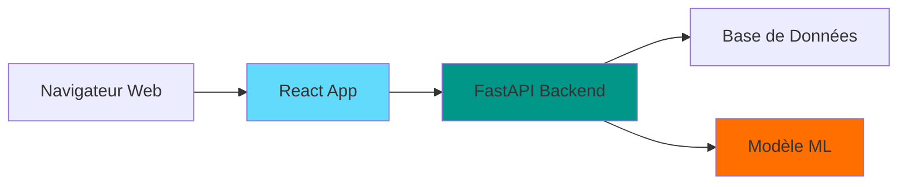

# Guide React UI pour Ingénieur IA/Data

Bienvenue dans ce guide pratique pour créer des interfaces web professionnelles adaptées aux projets IA et Data Science.

## Pour qui est ce guide ?

Ce guide s'adresse aux **ingénieurs IA et Data** ayant une expérience en développement backend (Python, FastAPI) mais peu ou pas d'expérience en développement frontend React. Si vous savez créer des modèles ML et des APIs, mais que créer une interface web vous semble intimidant, ce guide est fait pour vous.

## Pourquoi ce guide ?

En tant qu'ingénieur IA/Data, vous avez souvent besoin de créer rapidement des interfaces pour :
- **Annoter des données** : valider ou corriger des prédictions de modèles ML
- **Visualiser des résultats** : dashboards de métriques, graphiques de performance
- **Explorer des données** : tableaux interactifs avec filtres et tri
- **Prototyper des applications** : démonstrations de vos modèles

Plutôt que de déléguer systématiquement ces tâches ou d'utiliser des solutions peu flexibles, ce guide vous apprend à créer vous-même ces interfaces professionnelles, **en utilisant l'IA (Claude Code) comme accélérateur**.

## Ce que vous allez apprendre

À la fin de ce guide, vous serez capable de :

- ✅ **Créer un projet React moderne** avec Vite
- ✅ **Structurer votre code** de manière maintenable
- ✅ **Intégrer vos APIs FastAPI** proprement
- ✅ **Construire des interfaces d'annotation** avec validation en masse
- ✅ **Créer des tableaux interactifs** avec tri, filtres et pagination
- ✅ **Développer des dashboards** de visualisation avec graphiques
- ✅ **Utiliser Claude Code efficacement** pour accélérer votre développement
- ✅ **Appliquer les bonnes pratiques React** essentielles

## Stack technique

Ce guide utilise une stack moderne et pragmatique :

| Technologie | Utilisation | Pourquoi |
|------------|-------------|----------|
| **React** | Librairie UI | Standard de l'industrie, écosystème riche |
| **Vite** | Build tool | Recommandé par React, ultra-rapide |
| **React-Bootstrap** | Composants UI | Simple, professionnel, personnalisable |
| **FastAPI** | Backend API | Vous connaissez déjà ! |
| **Recharts** | Graphiques | Composants React natifs, facile |
| **TanStack Table** | Tableaux | Moderne, flexible, headless |

:::tip Pas besoin d'être expert
Vous n'avez pas besoin de maîtriser React en profondeur. Ce guide vous donne les concepts essentiels et montre comment utiliser l'IA pour le reste.
:::

## Prérequis

**Connaissances requises** :
- Bases de programmation (variables, fonctions, conditions, boucles)
- Notions Python et FastAPI (création d'endpoints REST)
- Concepts d'API REST et format JSON
- Utilisation du terminal et de npm

**Installation nécessaire** :
- Node.js >= 18 ([télécharger ici](https://nodejs.org/))
- Un éditeur de code (VS Code recommandé)
- Git pour le déploiement

**Pas requis** :
- Expertise JavaScript
- Expérience préalable en React
- Connaissances en CSS avancé
- Design graphique

## Structure du guide

Ce guide est organisé en **4 parties progressives** :

### 1. 🧱 Fondamentaux
Rappels React essentiels et setup d'un projet moderne avec Vite.

### 2. 🔌 Intégration API
Connexion de votre frontend React avec votre backend FastAPI.

### 3. 🎨 Interfaces Spécialisées
Création d'interfaces concrètes : annotation, tableaux, dashboards.

### 4. ⚡ Avancé
Bonnes pratiques, optimisations et workflow complet avec Claude Code.

## Comment utiliser ce guide

### Approche recommandée : séquentielle
Nous recommandons de suivre le guide dans l'ordre, section par section. Chaque section s'appuie sur les précédentes et introduit progressivement de nouveaux concepts.

### Approche alternative : par besoin
Si vous êtes pressé, vous pouvez aller directement aux sections qui vous intéressent :
- Besoin d'un tableau ? → [Section 5 : Tableaux](/interfaces/section-5-tables)
- Besoin d'un dashboard ? → [Section 6 : Dashboard](/interfaces/section-6-dashboard)
- Besoin d'intégrer une API ? → [Section 3 : FastAPI](/api-integration/section-3-fastapi)

:::warning Attention
L'approche par besoin nécessite de connaître les bases de React. Si c'est votre première expérience, commencez par la section 1.
:::

### Tester les exemples
Tous les exemples de code de ce guide sont **fonctionnels et testés**. Nous vous encourageons à :
- ✅ Copier-coller le code et l'exécuter localement
- ✅ Modifier le code pour l'adapter à vos besoins
- ✅ Utiliser les prompts Claude Code fournis pour générer votre propre code

### Utiliser l'IA
Chaque section contient des **prompts Claude Code recommandés**. Ces prompts sont optimisés pour générer du code de qualité adapté au contexte du guide.

:::info Claude Code
Claude Code est un assistant IA qui génère du code à partir de descriptions en langage naturel. C'est votre copilote pour accélérer le développement frontend.
:::

## Exemples fils rouges

Tout au long du guide, nous construisons **deux applications complètes** :

### 📝 AnnotaTool
Une interface d'annotation de documents avec classification automatique :
- Liste de documents avec prédictions ML
- Badges de confiance colorés
- Actions de validation/correction en masse
- Sauvegarde bulk vers API

### 📊 DashBoard ML
Un tableau de bord de monitoring d'annotations :
- Métriques clés (total, confiance moyenne)
- Graphiques : barres, lignes, camembert
- Évolution temporelle
- Distribution des scores

Ces exemples sont **représentatifs** de cas d'usage réels en IA/Data.

## Architecture type

Voici l'architecture classique que vous allez apprendre à créer :

**Flow typique** :
1. L'utilisateur interagit avec l'interface React
2. React envoie des requêtes à l'API FastAPI
3. FastAPI récupère des données (BDD) ou fait des prédictions (ML)
4. React affiche les résultats de manière interactive

## À quoi s'attendre

**Temps estimé** : 4-6 heures pour suivre l'intégralité du guide

**Résultat attendu** : Vous aurez créé une application React complète, connectée à une API, avec des interfaces d'annotation et de visualisation fonctionnelles.

**Après ce guide** : Vous serez autonome pour créer vos propres interfaces adaptées à vos projets IA/Data, en utilisant l'IA comme accélérateur.

## Prêt à commencer ?

Passez à la première section pour poser les fondations !

➡️ [Section 1 : Rappels React et Structure](/fundamentals/section-1-rappels-react)

---

**Questions ou feedback ?** Ce guide est un projet en constante amélioration. N'hésitez pas à signaler des erreurs ou suggérer des améliorations sur le [repository GitHub](https://github.com/dcram/guide-react-ia).
